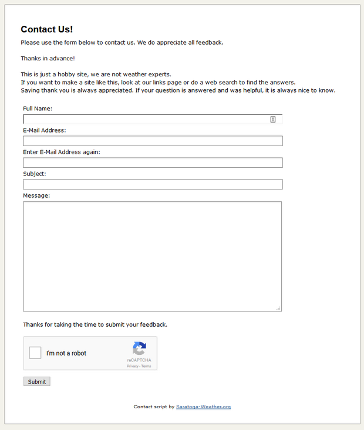
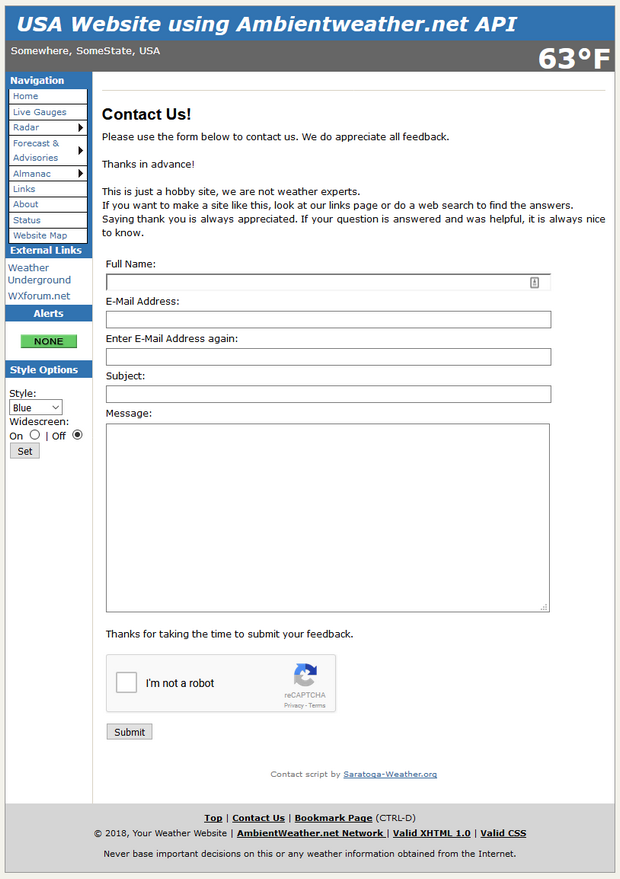

# Contact Page with Google reCAPTCHA V2.0

Having a 'safe' way to contact you on your website is a good idea. In 2008, Mike Challis of 642weather.com released a contact page for both standalone and Saratoga templates that used a built-in PHP script to create a captcha that minimized the ability of spambots to post messages. The bad news is that the spambots have caught on to the algorithm/structure of that captcha and so now can freely post spam using the old form/captcha that was released.

This script retools Mike's original form to use the Google reCAPTCHA V2.0 or hCaptcha which are very much more resistant to spambot postings. The script comes as a standalone _contact.php/contact-inc.php/contactH-inc.php_ which are English only. The Saratoga template _wxcontact.php/contact-inc.php/contactH-inc.php/wxcontact-**LL**.html_ offers multilingual use in the [Saratoga templates](https://saratoga-weather.org/wxtemplates/index.php) for all supported languages.

## Screen captures of standalone and Saratoga template use

<table style="border: none;" width="620">

<tbody>

<tr>

<th>Standalone</th>

<th>Saratoga Template</th>

</tr>

<tr>

<td></td>

<td></td>

</tr>

</tbody>

</table>

## Get a CAPTCHA Key pair and configure the script

This script requires a CAPTCHA SITE and SECRET key pair to operate:
For Google reCAPTCHA:

1.  Go to [**https://www.google.com/recaptcha/admin**](https://www.google.com/recaptcha/admin) and sign in to the site.
2.  Click on 'Register a new site' and fill in the following:
    1.  The Label field with a short name for your key pair
    2.  Select "reCAPTCHA V2" for the reCAPTCHA type
    3.  Fill in the website domain names (mywebsite.com, mywebsite.net, etc) in the Domains box for all the websites you will use the script.
    4.  Check the "Accept terms and conditions" checkbox
    5.  Leave the "Send alerts to owners" checkbox checked so you can be alerted to problems.
    6.  Press "Register" button
3.  When the page displays with "Adding reCAPTCHA to your sites", click on "Keys" to display the keys.
4.  Copy the contents of the "Site Key" to **_$recaptchaSiteKey_** variable in _contact-inc.php_ settings area.
5.  Copy the contents of the "Secret Key" to _**$recaptchaSecretKey**_ variable in _contact-inc.php_ settings area.
6.  Complete setup by configuring _**$logFile**_, _**$mailto**_ and **_$sitename_** variables as discussed below.
7.  Upload your configured contact-inc.php and test it.

For hCaptcha:

1.  Go to [**https://dashboard.hcaptcha.com/signup**](https://dashboard.hcaptcha.com/signup) and create a login ID and sign in to the site.
2.  Click on New Site' and fill in the following:
    1.  The Hostname using the site
    2.  The 'Interest Group' (which determines what type of images will be shown in the captcha)
    3.  Set the Captcha Difficulty as you wish. I use 'Difficult'.
    4.  Click on 'Save' and the dashboard should display.
3.  Click on the 'Settings' for the new key and copy the Site Key to the clipboard.
4.  Copy the contents of the "Site Key" to **_$recaptchaSiteKey_** variable in _contactH-inc.php_ settings area.
5.  Click on the 'Settings' tab on the dashboard page to show your Secret Key.
6.  Copy the contents of the "Secret Key" to _**$recaptchaSecretKey**_ variable in _contactH-inc.php_ settings area.
7.  Complete setup by configuring _**$logFile**_, _**$mailto**_ and **_$sitename_** variables as discussed below.
8.  Upload your configured _contactH-inc.php_.
9.  Change the **$useGoogle = true;** to **$useGoogle = false;** in _contact.php_ and _wxcontact.php_ to enable hCaptcha instead of the default Google reCaptcha
10.  Upload your configured _contact.php_ and _wxcontact.php_.
## Settings

Configure **_contact-inc.php_** with the settings for your website.

```php
############################################################################
# begin settings
############################################################################
# always configure these options before use
# always test your contact form after making changes
#
# This script REQUIRES a reCAPTCHA key pair.  Use
# https://www.google.com/recaptcha/admin to acquire a key pair
#  insert your Site Key and Site Secret Key in the two variables below

 $recaptchaSiteKey =   '-google-site-key-';   // your CAPTCHA site key
 $recaptchaSecretKey = '-google-secret-key-';   // your CAPTCHA site secret key

# Optional log file.  use '' as the name if a log file is not desired.
 $logFile = './contact-log.txt'; // optional text log of messages.  use '' to disable.

 # email address to receive messages from this form
 $mailto = 'somebody@somesite.com';

 # Site Name / Title
 $sitename = 'My Sitename';

############################################################################
# end settings
############################################################################

```

<dl>

<dt>**$recaptchaSiteKey**</dt>

<dd>This variable specifies your Google reCAPTCHA or hCaptcha SITE KEY. Copy from the CAPTCHA admin webpage.</dd>

<dt>**$recaptchaSecretKey**</dt>

<dd>This variable specifies your Google reCAPTCHA or hCaptcha SECRET KEY. Copy from the CAPTCHA admin webpage.</dd>

<dt>**$logFile**</dt>

<dd>This variable controls the optional text logfile of messages sent by the script. The default is './contact-log.txt'.  
**$logFile = '';** will disable creation of a log file.</dd>

<dt>**$mailto**</dt>

<dd>This is the full email address to receive the messages sent via the script</dd>

<dt>**$sitename**</dt>

<dd>This is a short name for your website. Email messages will arrive to $mailto address with a Subject line of:  
""$sitename contact: $subject" (where $subject is from the submitted message form).</dd>

</dl>

## Saratoga template multilingual configuration

There are two areas to configure for multilingual configuration. The _language-**LL**.txt_ and _wxcontact-**LL**.html_ files are the two files to configure for each _**LL**_ language on your site.

The following entries should be made to _language-**LL**.txt_:

```
# wxcontact.php entries
#
langlookup|Full Name:|Full Name:|
langlookup|E-Mail Address:|E-Mail Address:|
langlookup|Enter E-Mail Address again:|Enter E-Mail Address again:|
langlookup|Subject:|Subject:|
langlookup|Message:|Message:|
langlookup|Thanks for taking the time to submit your feedback.|Thanks for taking the time to submit your feedback.|
langlookup|Submit|Submit|
langlookup|Input Forbidden NL|Input Forbidden NL|
langlookup|Input Forbidden|Input Forbidden|
langlookup|A proper email address is required.|A proper email address is required.|
langlookup|The email addresses are not the same.|The email addresses are not the same.|
langlookup|Your name is required.|Your name is required.|
langlookup|A subject is required.|A subject is required.|
langlookup|Please complete reCaptcha before submit.|Please complete reCaptcha before submit.|
langlookup|Please make any necessary corrections and try again.|Please make any necessary corrections and try again.|
langlookup|Please enter your name and correct e-mail address here.|Please enter your name and correct e-mail address here.|
langlookup|A few people mistype their e-mail addresses, making it impossible for us to respond.|A few people mistype their e-mail addresses, making it impossible for us to respond.|
langlookup|Please double-check carefully.|Please double-check carefully.|
```
Select the text in the above code box, right-click, Copy then paste to the end of _language-**LL**.txt_ and change the third field (delimited by **|** ) with the language translation. Make sure the translation is done using the ISO-8859-n character set appropriate to your translation, **and not UTF-8**. Save and upload to your website.

Copy _wxcontact-en.html_ to _wxcontact-**LL**.html_ to make a new boilerplate file for language _**LL.**_ In the new file, the parts to edit are below the _**$main_top_text**_,_ **$welcome_intro**_ and **_$thank_you_** variables. You can use a mix of text, HTML and PHP if you like.  
If you need to use literal dollar signs ( **$** ), escape them by using ( **\\$** ), otherwise you'll have a PHP error.  
Make sure the translation is done using the ISO-8859-n character set appropriate to your translation, **and not UTF-8**.  
Also be careful to not disturb the end markers for each section.  
Translate the text as desired for each section, save and upload to your site.  
Note: If _wxcontact-**LL**.html_ is not available on your site for language _**LL**_, then the _wxcontact-**en**.html_ will be used, and if it is missing, the text in the _gen_boilerplate()_ function in _contact-inc.php_ will be used.
